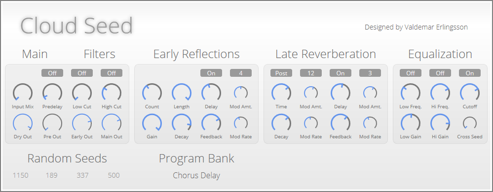
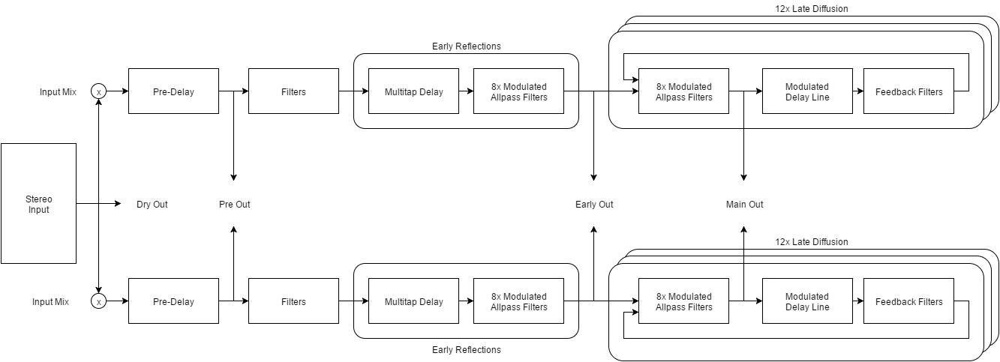

## Cloud Seed VST

Cloud Seed is an algorithmic reverb plugin built in C# and C++ for emulating huge, endless spaces and modulated echoes. The algorithms are based on the same principles as manu classic studio reverb units from the 1980's, but Cloud Seed does not attempt to model any specific device, or even to be a general-purpose reverb plugin at all. It is best employed as a special effect, for creating thick, lush pads out of simple input sounds. 

## Download & Install

1. Download the latest version of Cloud Seed from the [**Releases Page**](https://github.com/ValdemarOrn/CloudSeed/releases).
2. Copy the files into your VST plugin directory. Be sure to keep the 32 bit and the 64 bit folders separate, do not copy files from one directory over the other as this will make the plugin unloadable.  
3. Most users will need to install the Microsoft Visual Studio 2015 Redistributable Runtime. This component can be [**downloaded directly from Microsoft**](https://www.microsoft.com/en-us/download/details.aspx?id=48145) (Note: I've had some difficulty getting Microsoft's web site to work, if you have the same problems you can download the [**32 bit verion here**](http://download.microsoft.com/download/9/3/F/93FCF1E7-E6A4-478B-96E7-D4B285925B00/vc_redist.x86.exe) and the [**64 bit version here**](http://download.microsoft.com/download/9/3/F/93FCF1E7-E6A4-478B-96E7-D4B285925B00/vc_redist.x64.exe).)

## Documentation

See the [**Documentation Page**](https://github.com/ValdemarOrn/CloudSeed/tree/master/Documentation) for an overview of the user interface and an explanation of the reverberation kernel.

## Reverb Kernel Architecture

the code was originally developed in C# and then ported over to C++. The current version contains a full implementation of the reverb kernel in CPU-efficient C++ code. The user interface is built using WPF (Windows Presentation Foundation), and the plugin uses [SharpSoundDevice](https://github.com/ValdemarOrn/SharpSoundDevice) to communicate with a VST host.